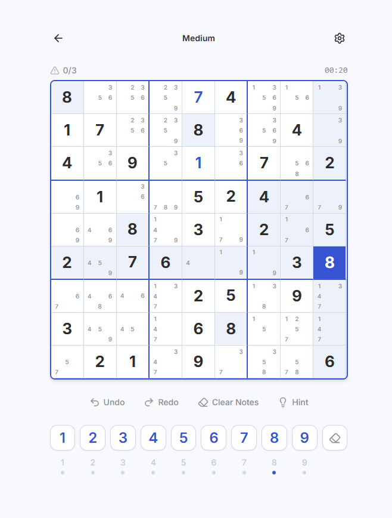

# 数独 Calm — Sudoku Online

A clean, calm Sudoku game built with **React + TypeScript** and a **Rust WASM** engine. Play instantly in your browser — no ads, no distractions.

[Play Now]([https://duankong.github.io/SudoKu-Online](https://duankong.github.io/SudoKu-Online/)) · [GitHub](https://github.com/duankong/SudoKu-Online)

<p align="center">
  
  &nbsp;&nbsp;
  
</p>

## Features

- **4 Difficulty Levels** — Easy, Medium, Hard, Expert
- **Daily Challenge** — A new puzzle every day, same for everyone
- **Smart Hints** — 7 solving strategies (Naked Single, Hidden Single, Naked/Hidden Pair, Pointing, Box-Line Reduction, X-Wing) with Chinese/English explanations
- **Undo / Redo** — Full move history
- **Auto Notes** — Auto-fill pencil marks for all empty cells
- **Progress Saving** — Auto-save, continue anytime
- **Keyboard Shortcuts** — 1–9 to input, Delete to erase, Ctrl+Z/Y for undo/redo, arrow keys to navigate
- **i18n** — English & 中文
- **Zero Dependencies on Servers** — WASM engine runs entirely in your browser

## Tech Stack

| Layer | Technology |
|-------|------------|
| UI | React 18, TypeScript, TailwindCSS, Lucide Icons |
| Router | React Router (Hash) |
| i18n | react-i18next |
| Engine | Rust → WASM (via wasm-pack) |
| Hosting | GitHub Pages |

## Project Structure

```
sudokucalm/
├── wasm-engine/              # Rust WASM engine
│   └── src/
│       ├── generator.rs      # Puzzle generation (backtrack fill + dig holes)
│       ├── solver.rs         # Backtracking solver & uniqueness check
│       ├── validator.rs      # Conflict detection & game status
│       ├── hint_engine.rs    # 7-strategy smart hint system
│       ├── history.rs        # Undo/redo history stack
│       └── highlight.rs      # Related area & same-number highlights
├── src/
│   ├── pages/                # Dashboard, Game, Settings
│   ├── components/           # GridBoard, Cell, NumberPad, Toolbar, HintDrawer
│   ├── hooks/                # useGameEngine, useLocalStorage, useTimer
│   └── types/                # TypeScript types (ts-rs generated + manual)
└── assets/                   # Screenshots
```

## Development

### Prerequisites

- Node.js 20+
- Rust (stable) + `wasm32-unknown-unknown` target
- wasm-pack (`cargo install wasm-pack`)

### Quick Start

```bash
# Install dependencies
npm install

# Build Rust → WASM
npm run build:wasm

# Start dev server
npx kill-port 5173 5174 5175 5176 5177 5178 5179
npm run dev
# → http://localhost:5173
```

### Build & Test

```bash
# Rust tests
cd wasm-engine && cargo test

# Production build
npm run build
# → dist/
```

## How the WASM Engine Works

```
JS  dispatch(action_json) → Rust reduce(state, action) → new_state_json
     load_state(json)      → Restore saved game
     new_game(difficulty)  → Generate puzzle
     new_daily(date)       → Deterministic daily puzzle
```

All game logic — puzzle generation, solving, validation, hints — runs in WebAssembly. The React UI is a pure rendering layer.

## License

MIT
